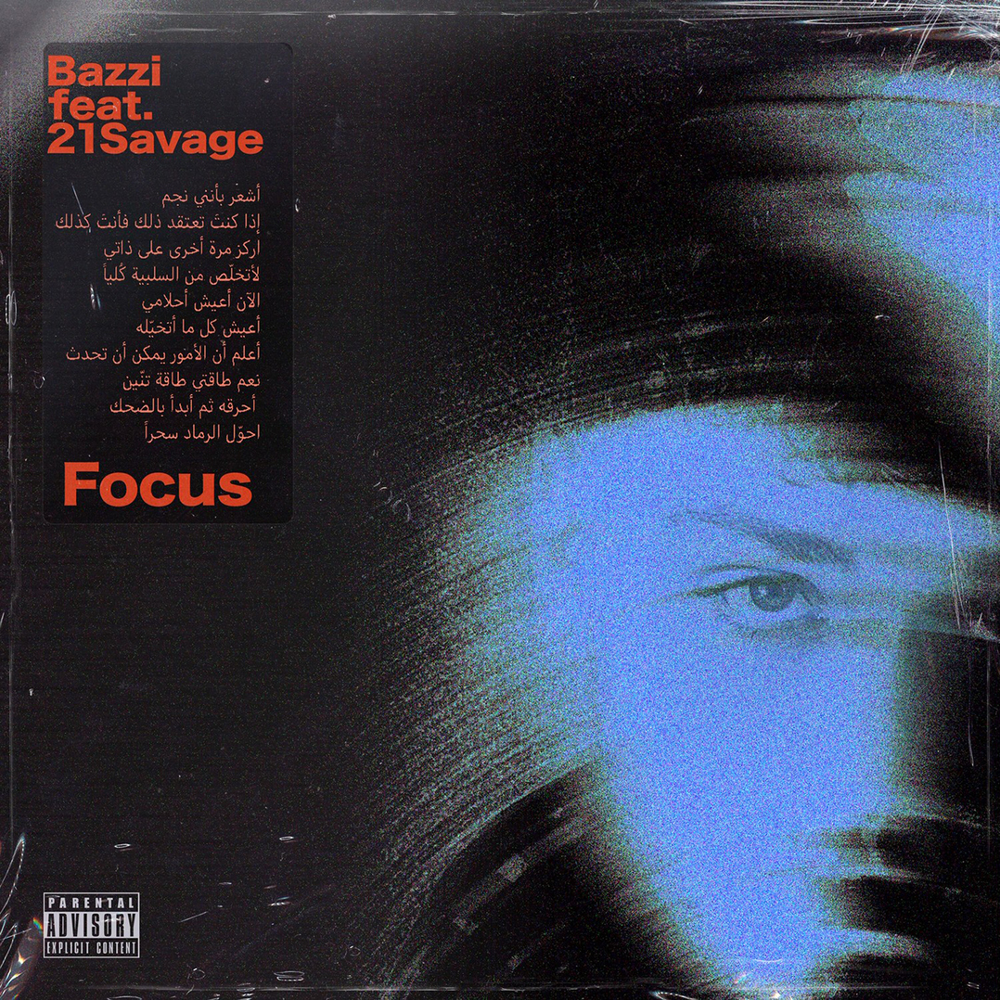

# AutoVJ

Real-time audio-reactive visual engine for DJs. Automatically syncs with Serato DJ Pro, displays album artwork with beat-driven shader effects, and uses AI to create unique visual atmospheres for each song.



## What It Does

- **Serato Auto-Sync**: Monitors Serato DJ Pro's database in real-time. When you load a track, AutoVJ automatically finds the matching cover art and lyrics.
- **Beat-Reactive Visuals**: Album artwork comes alive with 13 different shader effects (displacement, vortex, kaleidoscope, ripple, morph, etc.) that layer and blend based on kick/bass/beat energy.
- **AI Song Atmosphere**: Claude API analyzes each song's lyrics to generate a unique color palette, energy level, and visual mood. Dark songs get dark visuals, party songs get vibrant colors.
- **Auto Cover Art**: Matches covers from your local NetEase Cloud Music library (via track ID resolution), falls back to iTunes Search API.
- **DJ-Friendly**: No manual sync needed. Transitions happen when tracks actually start playing, not when loaded. Dual-deck priority follows whichever deck is live.

## Architecture

```
Serato DJ Pro ──> master.sqlite ──> Node.js Server (port 3456)
                                         |
DDJ-FLX4 ──> Browser Audio Capture       |──> WebSocket ──> Browser (port 5173)
                                         |
                                    iTunes API ──> Cover download
                                    NetEase API ──> Cover ID mapping
                                    Claude API ──> Song mood analysis
                                    ~/Music/ ──> LRC lyrics matching
```

## Quick Start

### Prerequisites

- **Node.js 20+** (install via `brew install node@22`)
- **Serato DJ Pro** (for automatic track detection)
- A DJ controller with audio output (e.g., DDJ-FLX4)

### Install

```bash
git clone https://github.com/ZiaNNNNN/AutoVJ.git
cd AutoVJ
npm install
```

### Configure

```bash
# Required: Claude API key for AI mood analysis
echo "ANTHROPIC_API_KEY=sk-ant-your-key-here" > .env

# Optional: Pre-analyze all songs (recommended, avoids 2-3s delay on first play)
npm run analyze
```

### Run

```bash
./start.sh
```

This starts both the backend (Serato monitor + cover fetcher) and frontend (visual engine). Open `http://localhost:5173` in Chrome, click **Start**, and begin DJing.

### If `npm` is not in PATH

The start script handles this automatically. If you need to run commands manually:

```bash
export PATH="/usr/local/Cellar/node@22/22.22.2_1/bin:$PATH"
npm run server   # Terminal 1: backend
npm run dev      # Terminal 2: frontend
```

## Audio Setup

AutoVJ captures audio directly from your DJ controller (DDJ-FLX4, etc.) via the browser's Web Audio API. It auto-detects the controller as an input device.

**Alternative: BlackHole** (if no controller input available)

1. `brew install blackhole-2ch`
2. Create a Multi-Output Device in Audio MIDI Setup (BlackHole + Speakers)
3. Set system output to the Multi-Output Device
4. AutoVJ will auto-detect BlackHole as input

## Controls

### Visual Modes

| Key | Mode |
|-----|------|
| `1` | **Cover Art** (default) - Album artwork + shader effects |
| `2` | **Word Cloud** - Floating lyric keyword particles |
| `Space` | Cycle modes |

### Tuning (press `` ` `` for debug panel)

| Key | Control | Description |
|-----|---------|-------------|
| `` ` `` | Debug panel | Show/hide real-time parameters |
| `+` / `-` | Effect Mix | More effects vs. more original image (default 40%) |
| `←` / `→` | Amplitude | Visual shake/pulse intensity |
| `<` / `>` | Reactivity | How easily beats trigger effects |
| `F` | Fullscreen | For second screen display |

### Other

| Key | Function |
|-----|----------|
| `D` | Switch active deck (for dual-deck priority) |
| `L` | Toggle lyrics overlay (hidden by default) |
| `Enter` | Restart lyrics timer |
| `[` / `]` | Lyrics offset -5s / +5s |
| `Tab` | Track panel (manual file loading) |

## Shader Effects (13 types)

Effects layer up to 3 simultaneously, triggered by beats and auto-cycling:

| Effect | Style | Weight |
|--------|-------|--------|
| Displace | Organic noise warp | Common |
| Drift | Cinematic zoom pan | Common |
| Vortex | Spiral swirl | Occasional |
| Kaleidoscope | Mirror symmetry | Occasional |
| Ripple | Water surface | Common |
| Scan | Horizontal displacement | Common |
| Morph | Elastic deformation | Common |
| Fragment | Smooth shatter | Occasional |
| Ghost | Double vision offset | Common |
| Pan | Ken Burns slow motion | Common |
| Radial Blur | Center blur pulse | Common |
| Prism | RGB channel split | Common |
| Breathe | Slow zoom in/out | Very common |

Plus always-on: film grain, CRT scanlines, cinematic vignette, chromatic aberration, kick-driven zoom punch.

## AI Mood Analysis

Each song's lyrics are analyzed by Claude to generate:

```json
{
  "mood": "melancholic-aggressive",
  "energy": 0.7,
  "palette": [
    { "hue": 280, "sat": 0.8, "light": 0.3 },
    { "hue": 340, "sat": 0.9, "light": 0.4 },
    { "hue": 200, "sat": 0.5, "light": 0.2 }
  ],
  "keywords": ["brain", "love", "insane", "devil", "heart"],
  "beatReactivity": 0.8,
  "distortionLevel": 0.6
}
```

Results are cached in `server/.cache/analysis/`. Run `npm run analyze` to pre-analyze your library.

## Music Library

AutoVJ scans `~/Music/网易云音乐/` for:
- `.lrc` files (lyrics) - matched by filename
- `meta/track-{ID}.jpg` (covers) - resolved via NetEase API
- Falls back to iTunes Search API for covers not found locally

## Project Structure

```
AutoVJ/
├── start.sh                 # One-click launcher
├── index.html               # Entry page
├── src/
│   ├── main.js              # App entry, keyboard controls, integration
│   ├── audio/
│   │   ├── capture.js       # Audio device capture (DDJ/BlackHole/mic)
│   │   ├── analyzer.js      # FFT analysis, beat/kick detection, auto-gain
│   │   └── demoAnalyzer.js  # Simulated audio for testing
│   ├── visuals/
│   │   ├── manager.js       # Visual mode manager
│   │   ├── coverArt.js      # Cover art shader (13 effects, 3 layers)
│   │   └── wordParticles.js # Keyword particle system
│   ├── lyrics/
│   │   ├── parser.js        # LRC file parser
│   │   ├── renderer.js      # Lyrics text display
│   │   └── songMood.js      # AI mood parameter interpolation
│   ├── tracks/
│   │   ├── manager.js       # Manual track file loading
│   │   └── seratoSync.js    # WebSocket client for Serato sync
│   └── ui/
│       ├── overlay.js       # HUD overlay
│       └── trackPanel.js    # Track selection panel
├── server/
│   ├── index.js             # Express + WebSocket server
│   ├── seratoWatcher.js     # Serato SQLite database monitor
│   ├── lrcIndex.js          # LRC file scanner/matcher
│   ├── coverFetcher.js      # Cover art fetcher (local + iTunes)
│   ├── songAnalyzer.js      # Claude API mood analyzer
│   └── preanalyze.js        # Batch pre-analysis script
└── .env                     # ANTHROPIC_API_KEY
```

## Tech Stack

- **Frontend**: Three.js + custom GLSL shaders, Web Audio API
- **Backend**: Node.js, Express, WebSocket, better-sqlite3
- **AI**: Anthropic Claude API (song mood analysis)
- **Audio**: Web Audio API with auto-gain normalization
- **DJ Integration**: Serato DJ Pro SQLite database polling

## License

MIT
